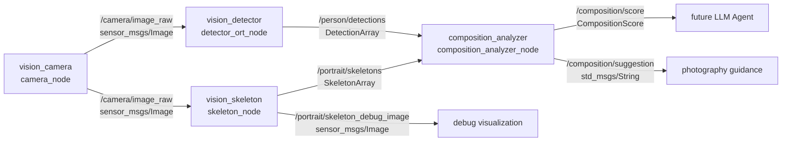

# Embodied Vision ROS2 Portrait Composition Assistant

基于 ROS2 的人像智能构图辅助 MVP。系统将摄像头采集、人体检测、骨架识别、构图规则分析、结构化评分和一键启动解耦为多个节点，当前面向“证件照/头像”场景，实时输出可解释的构图评分与拍摄建议。

## 当前能力

- 摄像头图像发布：`/camera/image_raw`
- YOLO + ONNX Runtime 人体检测：`/person/detections`
- MediaPipe Tasks Pose Landmarker 骨架识别：`/portrait/skeletons`
- 骨架 debug 图像：`/portrait/skeleton_debug_image`
- 证件照构图评分：`/composition/score`
- 人类可读拍摄建议：`/composition/suggestion`
- 自定义 ROS2 msg 接口：`portrait_interfaces`
- 一键启动：`embodied_vision_bringup`

## 系统架构



更多架构说明见 [docs/architecture.md](docs/architecture.md)。

## 包结构

```text
src/
  vision_camera/             # 摄像头采集与图像发布
  vision_detector/           # YOLO ONNX Runtime 人体检测
  vision_skeleton/           # MediaPipe Pose 骨架识别
  composition_analyzer/      # 构图规则、评分与建议
  portrait_interfaces/       # 自定义 msg 接口
  embodied_vision_bringup/   # launch 启动编排
```

## 主要话题

| Topic | Type | Description |
| --- | --- | --- |
| `/camera/image_raw` | `sensor_msgs/msg/Image` | 摄像头原始图像 |
| `/person/detections` | `portrait_interfaces/msg/DetectionArray` | 人体检测框 |
| `/portrait/skeletons` | `portrait_interfaces/msg/SkeletonArray` | 人体骨架关键点 |
| `/portrait/skeleton_debug_image` | `sensor_msgs/msg/Image` | 绘制骨架后的调试图像 |
| `/composition/score` | `portrait_interfaces/msg/CompositionScore` | 结构化构图评分 |
| `/composition/suggestion` | `std_msgs/msg/String` | 可读拍摄建议 |

## 环境依赖

已在 ROS2 Humble 风格工作空间下开发。核心依赖包括：

- ROS2 `rclcpp`, `rclpy`, `sensor_msgs`, `std_msgs`, `cv_bridge`
- OpenCV
- ONNX Runtime Python
- MediaPipe Tasks
- `nlohmann_json` 已不再用于主检测链路，检测结果改为自定义 msg

Python 依赖示例：

```bash
pip install onnxruntime mediapipe opencv-python numpy
```

注意：如果使用系统 ROS 的 `cv_bridge`，请优先保持 Python/Numpy/OpenCV 环境一致，避免二进制 ABI 冲突。

## 模型文件

当前项目使用本地模型文件：

- YOLO ONNX：`src/vision_detector/models/yolov8n.onnx`
- MediaPipe Pose：`src/vision_skeleton/models/pose_landmarker_lite.task`

构建时这些模型会被安装到对应包的 `share/<package>/models/` 目录，节点默认从 ROS2 package share 目录读取模型。发布到 git 时可以选择保留这些模型文件；如果后续模型变大，建议改为 README 下载说明或 Git LFS。

## 构建

```bash
cd /home/fj/embodied_vision_ws
colcon build
source install/setup.bash
```

只构建 MVP 相关包：

```bash
colcon build --packages-select \
  portrait_interfaces \
  vision_camera \
  vision_detector \
  vision_skeleton \
  composition_analyzer \
  embodied_vision_bringup
source install/setup.bash
```

## 运行

一键启动完整 pipeline：

```bash
ros2 launch embodied_vision_bringup composition_pipeline.launch.py
```

常用参数：

```bash
ros2 launch embodied_vision_bringup composition_pipeline.launch.py \
  device_id:=0 \
  image_width:=1280 \
  image_height:=720 \
  fps:=30 \
  detector_show_window:=true \
  skeleton_publish_debug_image:=true
```

查看 launch 参数：

```bash
ros2 launch embodied_vision_bringup composition_pipeline.launch.py --show-args
```

## 调试命令

查看节点：

```bash
ros2 node list
```

查看话题：

```bash
ros2 topic list
```

查看检测结果：

```bash
ros2 topic echo /person/detections
```

查看骨架结果：

```bash
ros2 topic echo /portrait/skeletons
```

查看结构化评分：

```bash
ros2 topic echo /composition/score
```

查看文本建议：

```bash
ros2 topic echo /composition/suggestion
```

查看骨架调试图像：

```bash
ros2 run rqt_image_view rqt_image_view
```

然后选择：

```text
/portrait/skeleton_debug_image
```

## MVP 规则说明

当前 `composition_analyzer` 面向证件照/头像场景，规则包括：

- 人物水平位置是否居中
- 人物画面占比是否合适
- 肩线是否水平
- 身体中轴是否偏斜
- 头部相对肩部是否居中
- 头顶留白规则预留，后续可结合人脸框或头顶估计继续完善

规则实现集中在：

```text
src/composition_analyzer/src/composition_rules.cpp
```

ROS2 节点层只负责消息订阅、消息转换和结果发布。

## 发布到 Git 的建议步骤

当前目录如果还不是 git 仓库，可以执行：

```bash
cd /home/fj/embodied_vision_ws
git init
git add README.md docs .gitignore src
git status
git commit -m "Initial MVP: ROS2 portrait composition assistant"
```

创建远端仓库后：

```bash
git remote add origin <your-repo-url>
git branch -M main
git push -u origin main
```

提交前建议确认没有把生成目录加入 git：

```bash
git status --short
```

不应出现：

```text
build/
install/
log/
```

## 后续方向

- 使用 `CameraInfo` 和相机内参把像素偏差转换为空间角度误差
- 增加 TF 坐标系，表达 `base_link -> gimbal_link -> camera_link -> camera_optical_frame`
- 新增 `spatial_perception_node` 输出人物相对相机光轴的 yaw/pitch 偏差
- 新增 LLM Agent 节点，消费 `/composition/score` 生成个性化建议
- 新增语义分割/人脸关键点，提高背景、头顶留白和眼睛线分析能力
- 新增云台控制节点，形成主动构图闭环
