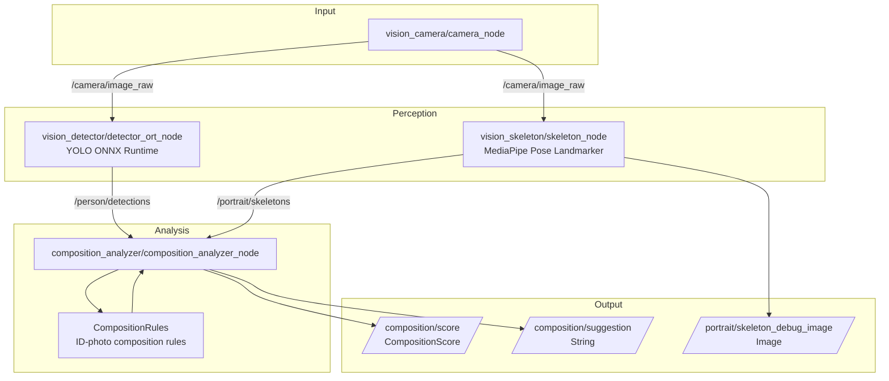
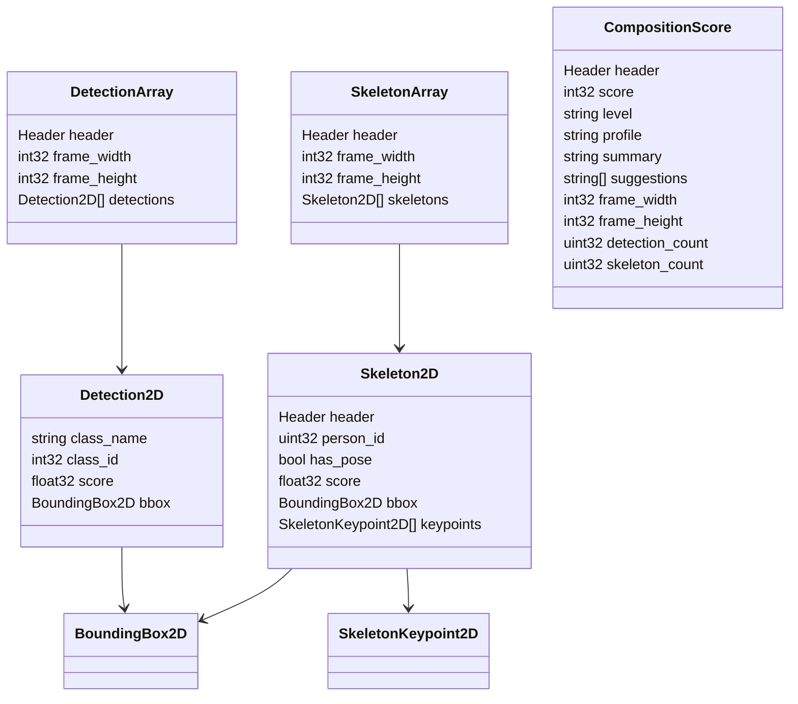
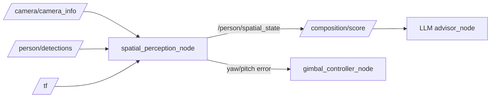

# Architecture

本文档记录当前 MVP 的 ROS2 节点架构、数据流和后续扩展方向。

## MVP Data Flow



## Node Responsibilities

| Package | Node | Responsibility |
| --- | --- | --- |
| `vision_camera` | `camera_node` | Capture camera frames and publish `sensor_msgs/Image` |
| `vision_detector` | `detector_ort_node` | Run YOLO ONNX Runtime inference and publish person detections |
| `vision_skeleton` | `skeleton_node` | Run MediaPipe Pose Landmarker and publish skeleton keypoints |
| `composition_analyzer` | `composition_analyzer_node` | Fuse detections and skeletons, call composition rules, publish score and advice |
| `portrait_interfaces` | N/A | Define shared ROS2 msg types |
| `embodied_vision_bringup` | launch | Start the full MVP pipeline |

## Message Interfaces



## Runtime Topics

```text
/camera/image_raw
  sensor_msgs/msg/Image

/person/detections
  portrait_interfaces/msg/DetectionArray

/portrait/skeletons
  portrait_interfaces/msg/SkeletonArray

/portrait/skeleton_debug_image
  sensor_msgs/msg/Image

/composition/score
  portrait_interfaces/msg/CompositionScore

/composition/suggestion
  std_msgs/msg/String
```

## Launch

Main launch file:

```text
src/embodied_vision_bringup/launch/composition_pipeline.launch.py
```

Run:

```bash
source install/setup.bash
ros2 launch embodied_vision_bringup composition_pipeline.launch.py
```

## Rule Layer

The node layer converts ROS2 messages into plain C++ structures:

```text
DetectionArray -> std::vector<PersonBox>
SkeletonArray  -> std::vector<SkeletonInfo>
```

Then it calls:

```cpp
rules_.analyze_id_photo(frame, person_boxes, latest_skeletons_);
```

Rule implementation lives in:

```text
src/composition_analyzer/src/composition_rules.cpp
```

Current rules:

- Subject horizontal position
- Subject scale in frame
- Shoulder line levelness
- Body axis tilt
- Head-to-shoulder alignment
- Headroom placeholder for future face/head estimation

## Future ROS2-Robotics Extensions

The next stage should make ROS2 more central by adding spatial perception:



Recommended additions:

- Publish `sensor_msgs/CameraInfo` from the camera node.
- Convert image-space person center into normalized camera ray.
- Compute yaw/pitch error from camera intrinsics.
- Add TF frames such as `base_link`, `gimbal_link`, `camera_link`, `camera_optical_frame`.
- Add a simulated or real `gimbal_controller_node`.
- Let an LLM Agent consume `/composition/score` and `/person/spatial_state` for personalized advice.
